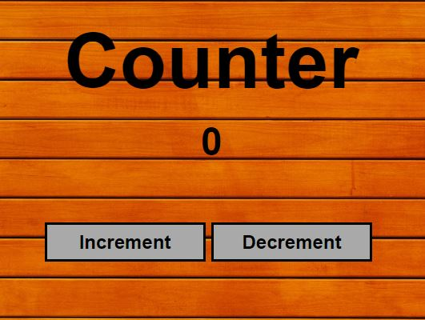

## Welcome to Front-end Development

This repository contains the source code for basic applications that a new web developer should know about.
All the appications in this repository has been made with the best industry practices and can be replicated anywhere with few changes.

### Up and Down Counter

Up and Down Counter is a basic counter application where on the click of a button the count value can either be incremented or decremented.

```Up and Down Counter


``
### Up and Down Counter

Up and Down Counter is a basic counter application where on the click of a button the count value can either be incremented or decremented.

```Up and Down Counter


``
### Up and Down Counter

Up and Down Counter is a basic counter application where on the click of a button the count value can either be incremented or decremented.

```Up and Down Counter


``
